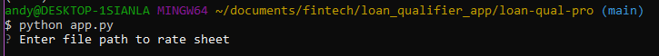
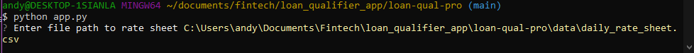
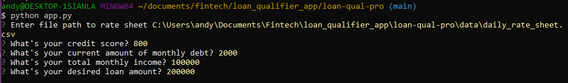
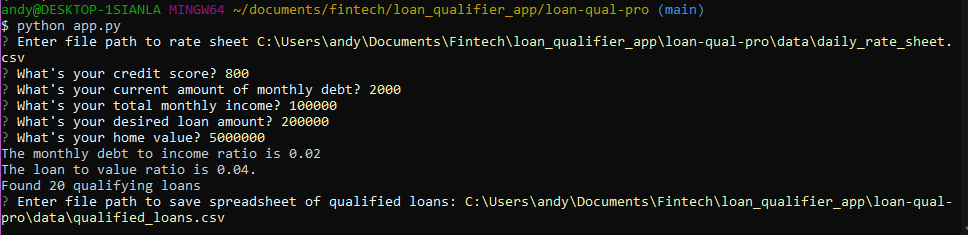
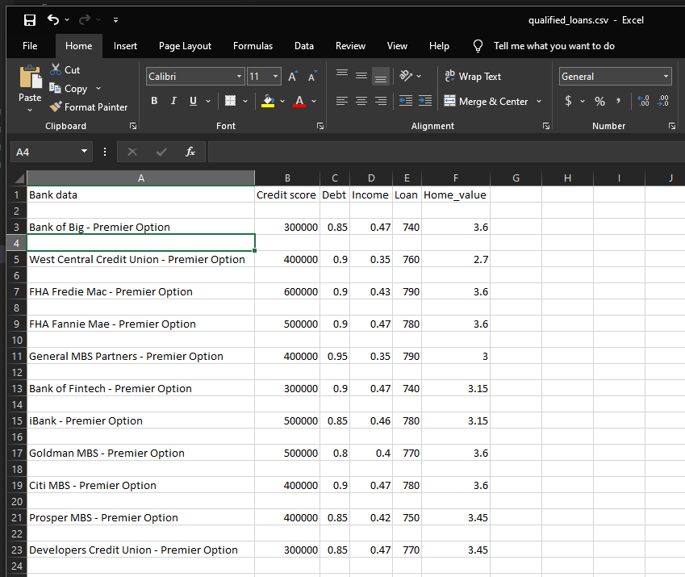

# Loan-Qual Pro

This CLI utility enables our loan system to accuratly screen customer loan applications and outputs a list of qualified lenders for the customer and Loan officer to review. This program takes a active look at live data from the companys rate sheet, and screens this list for basic minimum DTI and LTI criteria. Using this program, we can speed up the prequalification process and streamline the loan pipeline.

---

## Technologies

This project leverages python 3.7 with the following packages:

* [fire](https://github.com/google/python-fire) - For the command line interface and entry-point.

* [questionary](https://github.com/tmbo/questionary) - For interactive user prompts and dialogs

---

## Installation Guide

In this section, you should include detailed installation notes containing code blocks and screenshots.

Before using, install the following dependencies.

```python
  pip install fire
  pip install questionary

## Usage

This section should include screenshots, code blocks, or animations explaining how to use your project.






---

## Contributors

In this section, list all the people who contribute to this project. You might want recruiters or potential collaborators to reach you, so include your contact email and, optionally, your LinkedIn or Twitter profile.

---

## License

When you share a project on a repository, especially a public one, it's important to choose the right license to specify what others can and can't with your source code and files. Use this section to include the license you want to use.
